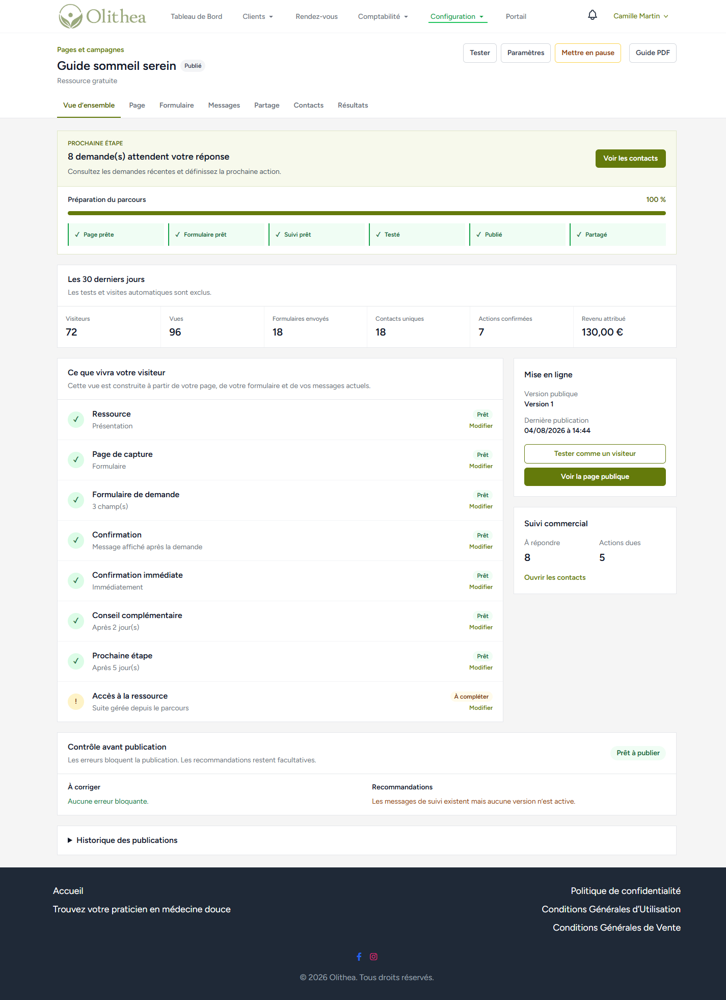
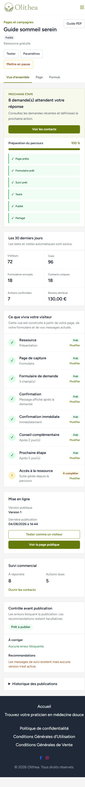
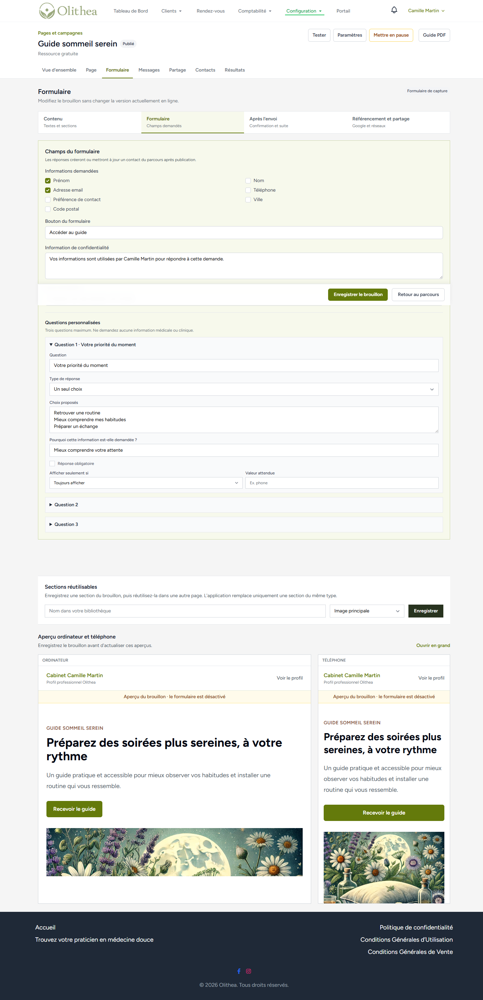
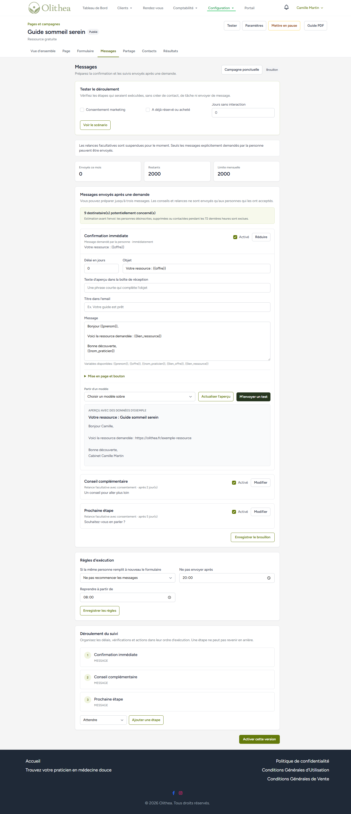
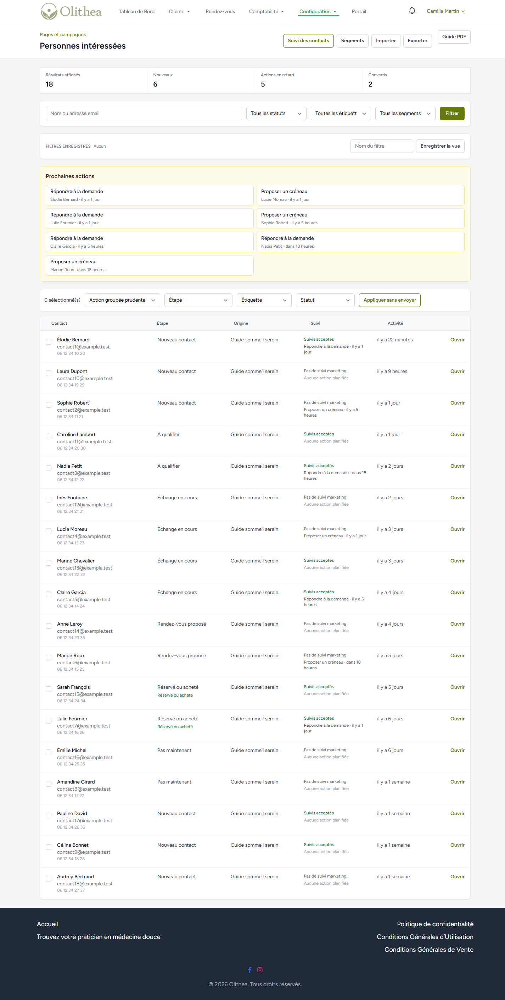
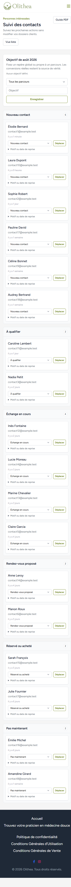
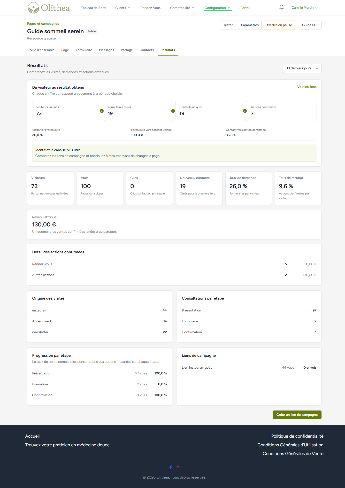
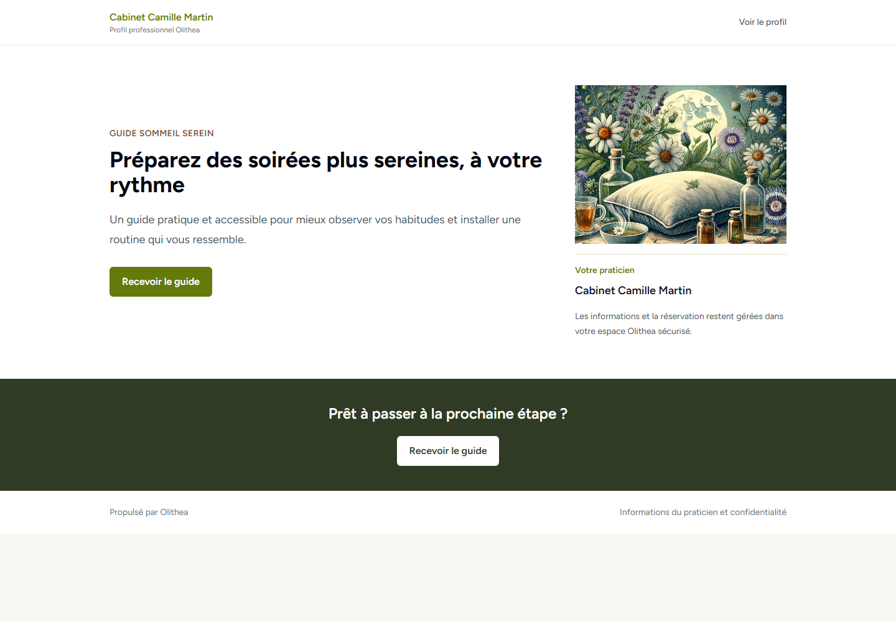
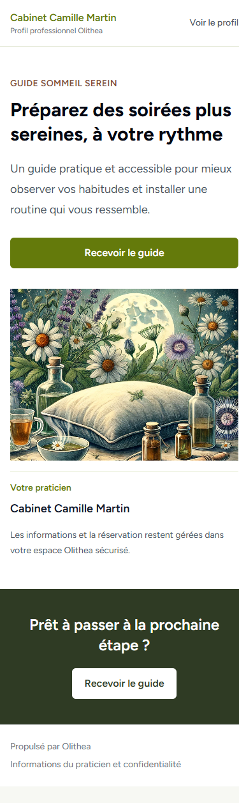
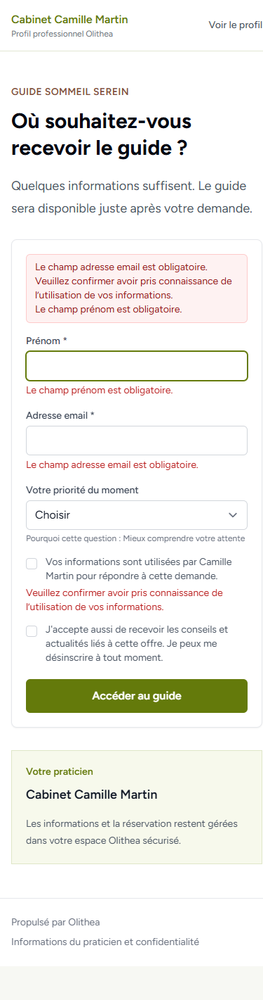

# Refonte produit - Pages et campagnes

Date de vérification : 4 août 2026

## Résumé

Le module est passé d'un assemblage d'outils techniques à un parcours commercial guidé : choisir un objectif, préparer la page et le formulaire, relire les messages, publier, partager, puis traiter les demandes et mesurer les résultats.

La refonte repose sur les modèles, versions publiées, contacts, consentements, campagnes et événements analytiques existants. Aucune migration de données n'a été ajoutée et aucun contenu publié existant n'est réécrit.

## Diagnostic produit

Avant la refonte :

- l'entrée « Parcours d'offres » ne disait pas clairement ce que le praticien pouvait accomplir ;
- la création demandait de comprendre la structure du module avant de voir le résultat attendu ;
- l'éditeur réunissait trop de réglages sur un même écran ;
- les formulaires, suites après envoi et messages exposaient des notions trop techniques ;
- la liste des contacts affichait un nombre de parcours au lieu de leur origine réelle ;
- le pipeline masquait sa limite de chargement et débordait sur mobile ;
- les statistiques mélangeaient personnes et actions ;
- certaines pages publiques finissaient sur un état sans action utile ;
- les aperçus sociaux ne garantissaient pas une URL d'image absolue.

Après la refonte :

- le produit promet une action simple : « Choisissez ce que vous souhaitez promouvoir. Olithea prépare la page, le formulaire et le suivi. » ;
- le nom visible du module est « Pages et campagnes » dans « Développer mon activité » ;
- chaque page dispose d'un espace de travail unique ;
- l'état et la prochaine action sont calculés depuis les vraies données ;
- les écrans emploient le vocabulaire Page, Formulaire, Messages, Partage, Contacts et Résultats ;
- les anciennes routes, données et versions restent compatibles.

## Nouvelle architecture

### Niveau module

- Pages et campagnes
- Créer une page et son suivi
- Personnes intéressées
- Suivi des contacts
- Segments et étiquettes
- Campagnes email, uniquement si le pilote correspondant est actif

### Niveau page ou campagne

- Vue d'ensemble
- Page
- Formulaire
- Messages
- Partage
- Contacts
- Résultats

La vue d'ensemble affiche la prochaine action, la préparation réelle, les indicateurs principaux et une carte visuelle du parcours. Les états `Prêt`, `À compléter`, `Désactivé` et `Erreur` ne constituent pas une deuxième source de vérité.

## Parcours réalisés

### 1. Création guidée

Le praticien choisit d'abord son résultat : demandes, rendez-vous, événement, ressource gratuite, formation ou bon cadeau. Olithea prépare ensuite la page, le formulaire éventuel, la confirmation et les brouillons de suivi sans publier automatiquement.

Les ressources homonymes sont distinguées par durée, date, prix et état. Le brouillon du formulaire de création est conservé dans la session du navigateur en cas d'actualisation accidentelle.

### 2. Édition en quatre étapes

L'éditeur est séparé en Contenu, Formulaire, Après l'envoi et Référencement et partage. Les onglets sont accessibles au clavier et restent utilisables sans JavaScript pour l'enregistrement et la validation serveur.

La suite après envoi décrit l'action réelle. Une confirmation ne promet plus un email quand aucun message n'est configuré. Une page sans action configurée renvoie utilement vers le profil du praticien au lieu d'afficher une offre indisponible sans issue.

### 3. Messages

Les messages de suivi acceptent un contenu structuré commun : titre, paragraphe, image, bouton, informations pratiques et signature. Ils proposent objet, pré-en-tête, aperçu, modèles sobres et envoi de test au praticien uniquement.

Les anciens messages texte restent lisibles, modifiables et envoyables. L'envoi de campagnes reste protégé par les pilotes existants ; cette refonte n'active aucun envoi global.

### 4. Contacts et suivi

La liste affiche le nom, les coordonnées, l'étape, l'origine réelle, le consentement de suivi, la prochaine action et la dernière activité. Les actions groupées n'envoient aucun message.

Les étiquettes peuvent être créées, renommées et supprimées avec contrôle de propriété. Les segments expliquent leur logique en français et donnent une estimation en direct. Le pipeline affiche les vrais totaux, signale les contacts non chargés et conserve un sélecteur accessible en plus du glisser-déposer.

### 5. Résultats

Les indicateurs distinguent : visiteurs uniques, vues, formulaires reçus, contacts uniques, nouveaux contacts, actions confirmées et revenu attribué.

Trois taux rendent le parcours lisible :

- visite vers formulaire ;
- formulaire vers contact unique ;
- contact vers action confirmée.

Une répétition de formulaire augmente le nombre de formulaires reçus sans créer artificiellement un nouveau contact unique.

### 6. Pages publiques

Les pages emploient des modèles contrôlés, l'identité du praticien, une hiérarchie claire, un CTA réel et une présentation responsive. Les métadonnées Open Graph et Twitter utilisent l'image sociale ou l'image principale avec une URL absolue.

## Captures après refonte

### Espace de travail





### Édition et messages






### Contacts et résultats







### Pages publiques







Le dossier `screenshots` contient 32 captures : accueil du module, assistant de création, quatre sections d'édition, carte visuelle, messages, contacts, segments, pipeline, résultats, partage, trois modèles publics, validation et confirmation, aux formats mobile, tablette et desktop pertinents.

## Compatibilité

- aucune migration ajoutée ;
- aucune réécriture des pages, slugs ou versions publiées existantes ;
- anciennes URLs et noms de routes conservés ;
- ancien JSON de page toujours rendu ;
- anciens messages texte toujours pris en charge ;
- versions publiées toujours immuables ;
- contacts, consentements, attributions et événements analytiques conservés ;
- vérification de propriété maintenue sur les nouvelles actions d'étiquette et de segment ;
- réservations, événements, formations, bons cadeaux, paiements et visio non modifiés ;
- aucun envoi de campagne activé par cette refonte.

## Pilotes conservés

Les capacités restent gouvernées par `config/offer_journeys.php`, notamment :

- `OFFER_JOURNEYS_ENABLED`
- `OFFER_JOURNEYS_PUBLIC_PAGES_ENABLED`
- `OFFER_JOURNEYS_BETA_USER_IDS`
- `OFFER_JOURNEYS_ALLOW_ALL`
- `OFFER_JOURNEYS_AUTOMATION_ENABLED`
- `OFFER_JOURNEYS_EMAIL_ENABLED`
- `OFFER_JOURNEYS_PAUSE_ALL_MARKETING_EMAILS`
- `OFFER_JOURNEYS_MESSAGE_TOOLS_ENABLED`
- `OFFER_JOURNEYS_CAMPAIGNS_ENABLED`
- `OFFER_JOURNEYS_EMAIL_EDITOR_ENABLED`
- `OFFER_JOURNEYS_COMMERCIAL_TOOLS_ENABLED`
- `OFFER_JOURNEYS_CLIENT_TAGS_ENABLED`
- `OFFER_JOURNEYS_SEGMENT_CAMPAIGNS_ENABLED`

Le déploiement ne doit pas modifier ces valeurs sans décision produit explicite.

## Fichiers principaux

Nouveaux services :

- `app/Domain/OfferJourneys/Services/OfferJourneyWorkspace.php`
- `app/Domain/OfferJourneys/Services/OfferJourneyAutomationEmailComposer.php`

Nouvelles vues partagées :

- `resources/views/offer-journeys/practitioner/_workspace-header.blade.php`
- `resources/views/offer-journeys/practitioner/_workspace-progress.blade.php`

Principaux écrans modifiés :

- contrôleurs Offer Journeys pour création, édition, messages, contacts, segments, pipeline, partage, statistiques et public ;
- vues praticien `create`, `show`, `pages/edit`, `automation`, `share`, `contacts`, `segments`, `pipeline`, `analytics` ;
- page publique `resources/views/offer-journeys/public/show.blade.php` ;
- rendu des emails et compatibilité des anciens contenus ;
- footer partagé mobile ;
- routes d'estimation de segment et de gestion des étiquettes ;
- tests de régression et d'expérience produit.

## Vérifications effectuées

- suite Offer Journeys : 83 tests, 494 assertions, tous réussis ;
- événements : 25 tests réussis ;
- rendez-vous : 24 tests réussis ;
- emails : 11 tests réussis ;
- packs : 18 tests réussis, 1 test SQLite déjà marqué comme ignoré ;
- bons cadeaux : 19 tests, 91 assertions ;
- formations digitales : 30 tests, 155 assertions ;
- profil et intégrations de paiement de facture : 9 tests, 39 assertions ;
- compilation Vite réussie ;
- syntaxe PHP vérifiée sur tous les fichiers applicatifs modifiés ;
- compilation de toutes les vues Blade réussie ;
- `git diff --check` sans erreur ;
- 48 vérifications Playwright sur 12 écrans à 390, 768, 1280 et 1440 px : aucun débordement ;
- formulaire public testé avec erreurs françaises, focus sur le premier champ et confirmation réelle ;
- déplacement d'un contact dans le pipeline testé puis remis dans son état initial ;
- estimation de segment testée sans envoi ;
- aucune erreur console sur les écrans vérifiés.

Le premier lancement local vers l'ancien tableau de bord général produit une erreur SQLite sur la fonction MySQL `MONTH()`. Ce comportement préexistant n'affecte pas le module ; l'URL directe ci-dessous fonctionne avec la base QA isolée.

## Revue locale

URL : `http://127.0.0.1:8091/dashboard-pro/parcours-offres`

Compte synthétique :

- email : `therapist@test.aromamade.local`
- mot de passe : `testtest`

La base utilisée est `storage/offer-journeys-qa.sqlite`. Le mailer est isolé et les relances marketing sont suspendues. Les données et emails de production n'ont pas été utilisés.

## Déploiement

Aucune migration nouvelle n'est nécessaire. Procédure proposée après commit et revue :

```bash
git pull --ff-only
composer install --no-dev --optimize-autoloader
npm ci
npm run build
php artisan optimize:clear
php artisan migrate --force
php artisan config:cache
php artisan route:cache
php artisan view:cache
php artisan queue:restart
```

Ne pas ouvrir les pilotes à tous les praticiens au même moment que le déploiement. Conserver d'abord la liste d'utilisateurs pilote et `OFFER_JOURNEYS_PAUSE_ALL_MARKETING_EMAILS=true` pendant la vérification fonctionnelle.

## Checklist manuelle en production

1. Ouvrir Pages et campagnes avec un compte pilote et un compte non autorisé.
2. Ouvrir un ancien parcours publié et vérifier que son URL publique est inchangée.
3. Créer chaque objectif en brouillon sans publier.
4. Vérifier Contenu, Formulaire, Après l'envoi et Référencement et partage.
5. Tester le formulaire avec des champs vides, puis avec une adresse de test autorisée.
6. Vérifier la confirmation, la ressource ou la destination réellement configurée.
7. Envoyer uniquement un email de test au praticien ; ne pas lancer de campagne réelle.
8. Vérifier la liste des contacts, l'origine, le consentement et la prochaine action.
9. Créer puis supprimer une étiquette de test sur un contact du même praticien.
10. Estimer un segment et confirmer qu'aucun message n'est envoyé.
11. Déplacer un contact dans le pipeline puis le remettre dans son étape initiale.
12. Vérifier les visiteurs, formulaires, contacts et conversions avec une période connue.
13. Tester une page publique sur iPhone, tablette et desktop.
14. Contrôler le titre, la description et l'image avec un outil d'aperçu Open Graph.
15. Vérifier une réservation, un événement, une formation et un bon cadeau associés.

## Limites et suite recommandée

- la fusion assistée des étiquettes en double reste à concevoir ; renommer et supprimer sont disponibles ;
- le pipeline montre jusqu'à 50 contacts par étape, le vrai total et un lien vers la liste complète, plutôt qu'un chargement infini ;
- l'éditeur visuel riche des campagnes reste derrière son pilote dédié ;
- les recommandations statistiques restent prudentes tant que le volume est insuffisant ;
- les visiteurs uniques reposent sur l'identifiant de session disponible et restent donc une estimation ;
- une ancienne page publiée sans formulaire ni action affiche désormais un accès au profil ; les nouvelles demandes de rappel créées par l'assistant préparent bien leur formulaire ;
- l'approbation juridique des textes de consentement, SES et la configuration DNS restent hors de ce chantier.

## Confirmation de sécurité

Aucun email réel n'a été envoyé. Aucune donnée de production n'a été lue, modifiée ou supprimée. Les essais de formulaire, de pipeline, de segment et de statistiques ont été réalisés exclusivement avec un compte et une base SQLite synthétiques locaux.
