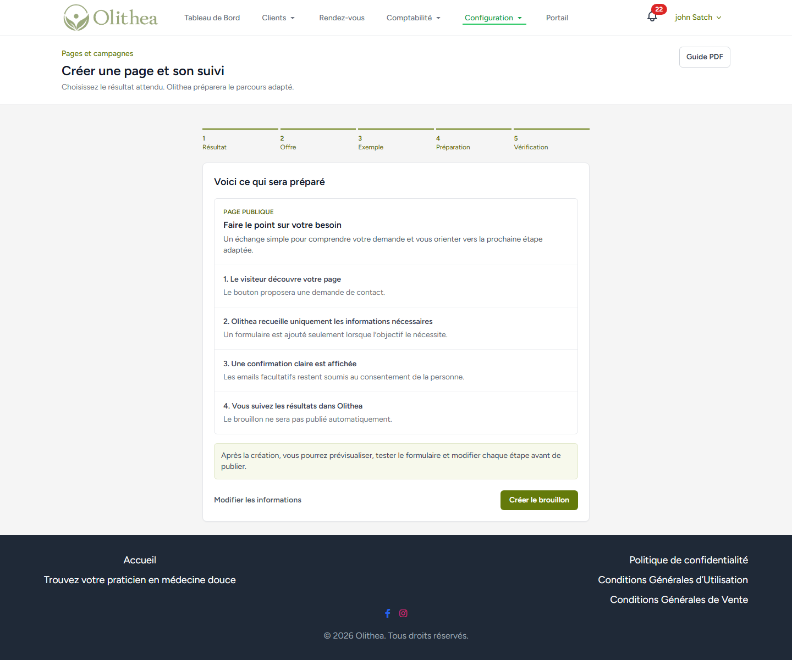
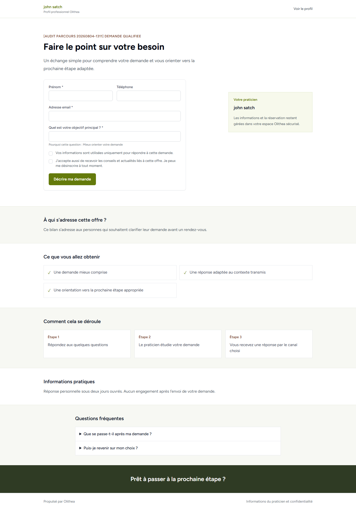
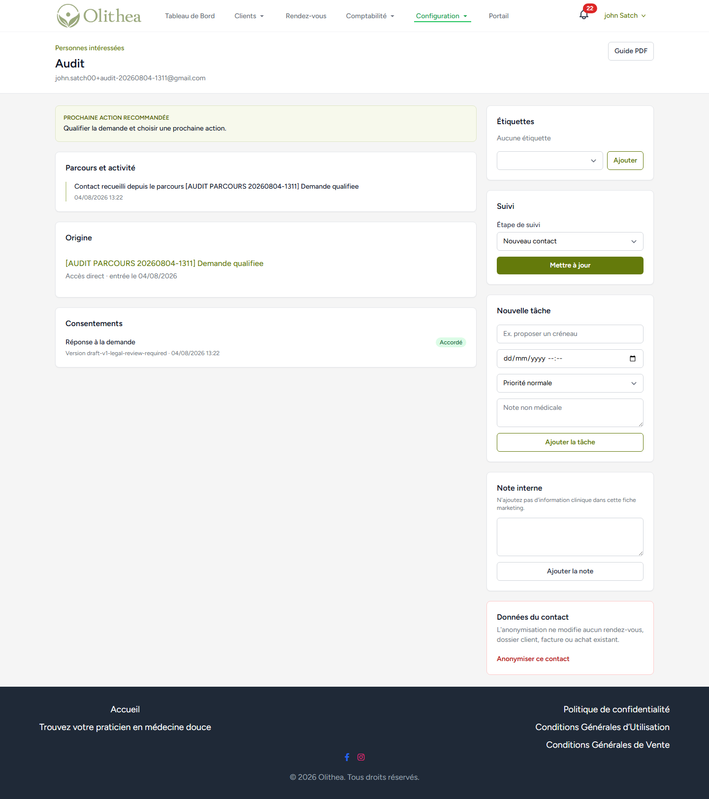
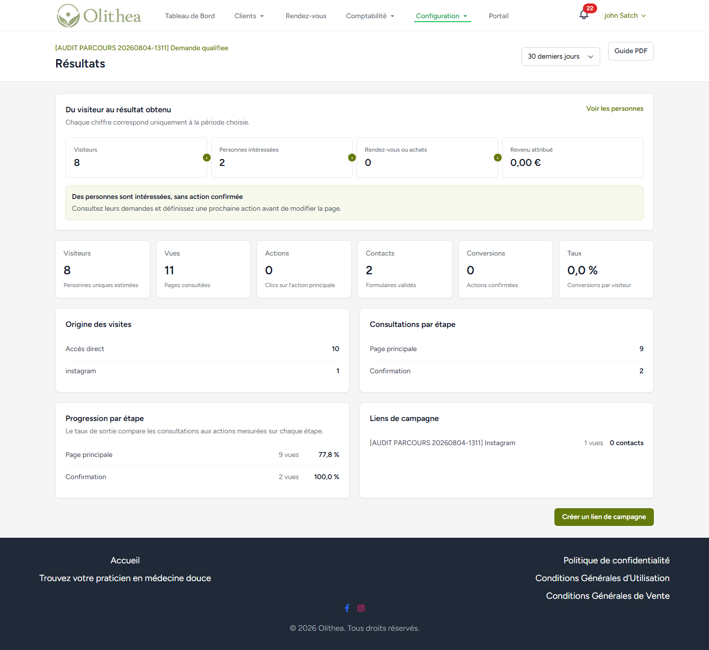
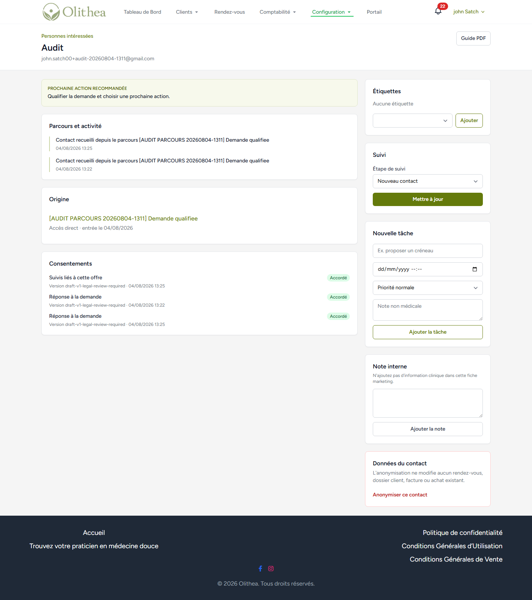
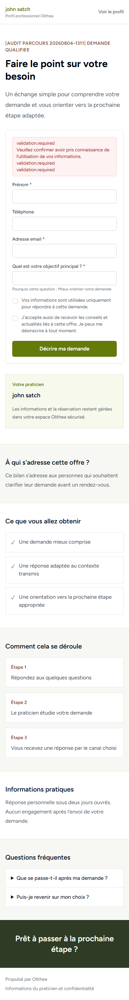
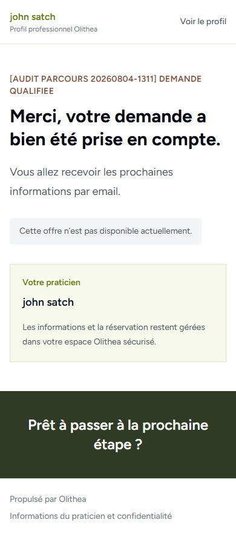
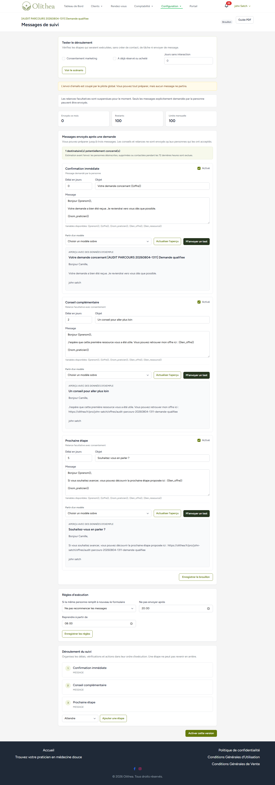
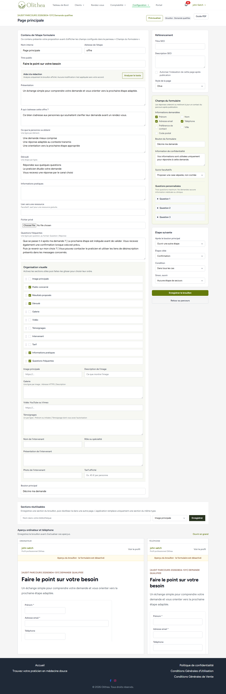
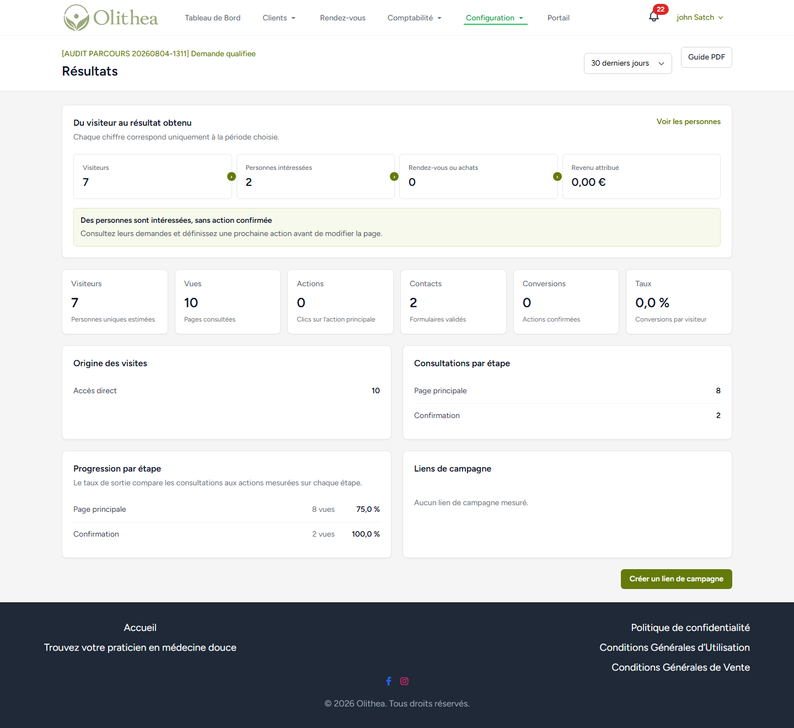

# Audit produit et production - Pages et campagnes

**Date :** 4 août 2026  
**Périmètre :** fonctionnalité `Pages et campagnes` / `Parcours d'offres` sur la production Olithea  
**Méthode :** audit UX et fonctionnel en production avec un compte de test dédié, audit du code Laravel, tests automatisés locaux sur SQLite, vérification responsive et collecte de captures.  
**Nature de l'intervention :** audit uniquement. Aucun correctif applicatif, commit ou déploiement n'a été réalisé.

## Verdict exécutif

### Décision recommandée : **PILOTE LIMITÉ**

La fonctionnalité est suffisamment solide pour continuer avec un petit groupe de praticiens accompagnés et autorisés individuellement. La création guidée, la publication, le formulaire public, la déduplication des contacts, les segments, l'attribution, l'import réversible et le pipeline fonctionnent réellement.

Elle n'est **pas prête pour une ouverture large**. Deux conditions constituent un **No-Go de lancement général** :

1. La version de consentement enregistrée en production est encore `draft-v1-legal-review-required`.
2. L'envoi marketing est coupé et la configuration opérationnelle SES/SNS, DNS, workers, scheduler et rétention n'a pas pu être certifiée de bout en bout depuis l'interface.

La promesse produit dépasse aussi l'expérience actuelle : l'écran s'appelle `Pages et campagnes`, mais la console des campagnes et l'éditeur email riche renvoient une 404 en production. Les suivis automatiques proposent trois messages texte simples, pas encore un véritable éditeur d'emails professionnel.

**Score global : 6,4/10**

| Domaine | Score | Diagnostic |
|---|---:|---|
| Proposition de valeur | 7/10 | Le bénéfice devient clair une fois dans le module, mais le vocabulaire reste parfois hétérogène. |
| Première création | 7,5/10 | Assistant rassurant et progressif, avec modèles utiles. |
| Édition de page | 5/10 | Puissante, mais trop longue et dense pour un praticien non technique. |
| Page publique | 7/10 | Propre, responsive et crédible, mais encore générique et incomplète pour le partage social. |
| Formulaires et consentements | 5/10 | Capture et déduplication solides; version juridique en brouillon et erreurs techniques visibles. |
| Emails et automatisations | 4/10 | Séquence simple possible; campagne riche désactivée et envoi réel globalement coupé. |
| Contacts, segments et pipeline | 7/10 | Base CRM utile et actionnable; plusieurs incohérences et limites de montée en charge. |
| Mesure et attribution | 6/10 | UTM/liens dédiés fonctionnels; certains libellés ne correspondent pas aux calculs. |
| Mobile | 5,5/10 | Parcours principal utilisable; pipeline et pied de page débordent sur petit écran. |
| Sécurité applicative | 8,5/10 | Bonne isolation par propriétaire, politiques, idempotence et suppression email. |
| Exploitation | 6/10 | Les mécanismes existent, mais la configuration production doit être prouvée avant ouverture. |

## Ce que le produit doit être

### Positionnement recommandé

> Olithea aide un praticien à présenter une offre, recueillir une demande consentie, relancer avec justesse et transformer cet intérêt en rendez-vous ou en achat, sans assembler cinq outils marketing.

Le produit ne doit pas se présenter comme un « tunnel de vente » agressif. Sa différence est un parcours commercial sobre, éthique et relié aux objets déjà connus d'Olithea : prestations, événements, formations, bons cadeaux, rendez-vous et dossiers clients.

### Utilisateurs et besoins

- **Praticien débutant en marketing :** publier rapidement une page crédible sans savoir construire un funnel.
- **Praticien établi :** promouvoir un atelier, une ressource ou une offre et comprendre les canaux efficaces.
- **Praticien organisé :** qualifier les demandes, relancer avec consentement et suivre les prochaines actions.
- **Équipe Olithea :** diagnostiquer un échec sans accès direct à la base et protéger la réputation email commune.

### Parcours cible


### Cas d'usage attendus

1. Obtenir une demande de contact qualifiée.
2. Distribuer un guide, un audio ou une checklist contre une adresse email consentie.
3. Présenter une prestation et conduire vers la réservation.
4. Promouvoir un événement et conduire vers l'inscription.
5. Présenter une formation ou un bon cadeau et conduire vers l'achat.
6. Créer une courte séquence de suivi.
7. Envoyer une campagne à un segment consentant.
8. Mesurer les visites, formulaires, rendez-vous, achats et revenus par canal.
9. Transformer les contacts en prochaines actions concrètes.

## Cartographie vérifiée

Le module expose **61 routes** sous `parcours-offres`, **25 routes** sous `contacts-interesses` et un webhook SES. La structure observée est la suivante :

| Surface | Écrans ou actions | État constaté |
|---|---|---|
| Accueil du module | Liste, recommandations, usage, compteurs | Fonctionnel desktop/mobile |
| Création | Objectif, modèle, source, préparation, vérification | Fonctionnel |
| Gestion d'un parcours | Vue d'ensemble, réglages, versions, publication, archivage | Fonctionnel |
| Éditeur de page | Contenu, blocs, formulaire, SEO, transitions, aperçus | Fonctionnel mais trop dense |
| Aperçu | Brouillon signé, desktop et mobile | Fonctionnel |
| Page publique | Page, formulaire, confirmation, CTA, SEO | Fonctionnel avec défauts de cohérence |
| Partage | Lien principal, messages, QR code, liens par campagne | Fonctionnel |
| Résultats | Visites, sources, formulaires, conversions, revenus | Fonctionnel, sémantique à corriger |
| Automatisations | Jusqu'à trois messages et conditions | Fonctionnel en mode simple |
| Campagnes email | Liste, planification, test, éditeur riche | **404 en production** |
| Contacts | Liste, détail, consentements, activité, notes, tâches | Fonctionnel |
| Segments | Règles par statut, tag, parcours, inactivité, consentement | Fonctionnel |
| Pipeline | Colonnes, déplacement, motifs, objectifs | Fonctionnel avec défauts front/mobile |
| Import/export | Aperçu CSV, validation, commit, annulation | Fonctionnel et prudent |
| Support interne | Recherche, pause, relance, diagnostics | Présent dans le code, non vérifié en production |

## Parcours de production testé

Un parcours contrôlé a été créé avec un préfixe d'audit unique. Les opérations suivantes ont été réalisées sans toucher aux données d'autres utilisateurs :

- création guidée d'une demande qualifiée;
- édition d'une page avec un champ personnalisé obligatoire;
- aperçu desktop et mobile;
- publication puis accès public;
- soumission vide et soumission valide;
- nouvelle soumission avec la même adresse afin de vérifier la déduplication et l'ajout du consentement marketing;
- création d'un segment fondé sur le consentement;
- génération d'un lien de campagne et vérification de l'attribution;
- test d'un message vers l'adresse du praticien uniquement;
- import CSV d'un contact contrôlé, confirmation puis annulation;
- déplacement du contact via liste et glisser-déposer dans le pipeline;
- archivage du parcours et anonymisation du contact.

Le système a accepté la demande d'email test et affiché un succès. La réception dans la boîte n'a pas été vérifiée : cela prouve l'acceptation applicative, pas la livraison SES.







## Points forts

### 1. Une vraie base produit, pas une maquette

Le module gère versions publiées, redirections de slugs, formulaires, réponses structurées, contacts, consentements, tags, segments, automatisations, campagnes, attribution et conversions. Les migrations comportent des index et clés d'idempotence adaptés aux principales requêtes.

### 2. Isolation entre praticiens sérieuse

Les politiques vérifient systématiquement le propriétaire et l'accès au pilote. Les sélecteurs de ressources, segments, étapes du pipeline et contacts sont également bornés par `user_id`. Cette protection est couverte par les tests locaux. Voir [OfferJourneyPolicy.php](../../app/Domain/OfferJourneys/Policies/OfferJourneyPolicy.php#L11) et [OfferJourneyContactPolicy.php](../../app/Domain/OfferJourneys/Policies/OfferJourneyContactPolicy.php#L11).

### 3. Capture et consentement bien conçus techniquement

La capture publique est limitée à 10 requêtes par minute, utilise un honeypot, valide les champs côté serveur, déduplique par adresse normalisée et conserve une preuve du consentement. La seconde soumission de test a conservé un seul contact et ajouté une activité et un consentement distincts.

### 4. Défenses email matures dans le code

Le code prévoit liste de suppression, désinscription, limite de fréquence, quotas progressifs, heures calmes, idempotence, détection des bounces permanents, plaintes et rejets, vérification des messages SNS et pause globale. Voir [OfferJourneySendingPolicy.php](../../app/Domain/OfferJourneys/Services/OfferJourneySendingPolicy.php#L12) et [config/offer_journeys.php](../../config/offer_journeys.php#L15).

### 5. Import prudent

L'import propose un aperçu, valide les colonnes, exige une déclaration de preuve pour le consentement marketing, déduplique et permet l'annulation avant tout envoi. L'essai a été confirmé puis annulé sans laisser de contact actif.

### 6. Attribution utile

Les liens distincts par canal fonctionnent : une visite via le lien Instagram de test est apparue dans les résultats et le tableau des campagnes.



## Problèmes prioritaires

### P0 - Bloquants avant ouverture large

#### P0-01 - Consentement encore identifié comme brouillon juridique

**Constat :** la fiche contact de production affiche `draft-v1-legal-review-required` comme version de texte. C'est également la valeur par défaut du code dans [config/offer_journeys.php](../../config/offer_journeys.php#L53).

**Risque :** Olithea conserve une preuve technique, mais cette preuve pointe explicitement vers un texte non validé. Une ouverture marketing large avant validation fragiliserait la conformité et la capacité à expliquer les rôles du praticien et d'Olithea.

**Recommandation :** faire valider les deux textes, définir une version immuable datée, documenter responsable de traitement/sous-traitant, finalités et durées, puis imposer cette version par environnement.

**Critère de sortie :** aucun nouveau consentement ne peut porter une version contenant `draft`, et un test vérifie la version attendue en production.



#### P0-02 - Délivrabilité et exploitation non certifiées de bout en bout

**Constat :** les mécanismes existent dans le code, mais les emails marketing sont actuellement coupés par le pilote. La console de campagnes est inaccessible et l'audit n'a pas accès à la configuration DNS, aux abonnements SNS, aux workers, au scheduler ni aux alarmes.

**Risque :** activer largement les campagnes sans vérifier SPF/DKIM/DMARC, événements SES, files et rétention peut provoquer des envois bloqués, une réputation de domaine dégradée ou des traitements non exécutés.

**Recommandation :** réaliser un test opérationnel contrôlé avec une adresse consentante, vérifier livraison, désinscription, bounce permanent, plainte simulée, suppression, arrêt par quota, dashboard support, cron et files.

**Critère de sortie :** checklist signée avec preuves DNS, SNS, queue, scheduler, logs, alertes, taux de bounce et procédure de pause.

### P1 - À corriger avant un pilote autonome

#### P1-01 - Messages de validation bruts visibles

Le formulaire public et l'éditeur affichent `validation.required` au lieu d'un message français lié au champ. Le contrôleur ne fournit un texte personnalisé que pour la case de confidentialité dans [PublicOfferJourneyController.php](../../app/Http/Controllers/OfferJourneys/PublicOfferJourneyController.php#L125).

**Impact :** le visiteur peut croire que la page est cassée; le praticien perd confiance dans son brouillon.

**À faire :** traductions Laravel françaises complètes, noms de champs lisibles, résumé contextualisé, erreur sous chaque champ, focus sur le premier champ invalide.



#### P1-02 - La confirmation promet un email qui ne part pas forcément

Après une demande sans consentement marketing et alors que les emails sont coupés, la confirmation annonce : « Vous allez recevoir les prochaines informations par email ». Elle affiche aussi « Cette offre n'est pas disponible actuellement » puis une section finale sans bouton. Le texte est créé par défaut dans [OfferJourneyController.php](../../app/Http/Controllers/OfferJourneys/OfferJourneyController.php#L253) et le fallback est rendu dans [show.blade.php](../../resources/views/offer-journeys/public/show.blade.php#L95).

**Impact :** rupture immédiate de confiance et hausse des demandes support.

**À faire :** dériver le message de la prochaine action réelle : demande transmise, ressource disponible, réservation possible ou email effectivement programmé. Ne jamais annoncer un email sans consentement et canal actif.



#### P1-03 - « Campagnes » est promis mais indisponible

`/dashboard-pro/parcours-offres/campagnes-messages` renvoie une 404 et aucune entrée de navigation ne permet d'ouvrir l'éditeur riche. Les routes et le code existent, mais les flags sont désactivés.

**Impact :** le praticien ne peut pas créer une newsletter ou campagne segmentée, alors que le titre principal le laisse attendre.

**Décision produit :** soit renommer temporairement le module `Pages et contacts`, soit terminer le pilote email et n'afficher `Pages et campagnes` qu'aux utilisateurs autorisés à créer réellement une campagne.


#### P1-04 - Le suivi automatique n'est pas encore un éditeur email professionnel

L'automatisation permet trois messages avec objet, corps texte, délai, variables, aperçu et envoi test. C'est utile pour une V1, mais insuffisant pour créer un « beau fil d'emails » : pas de blocs visuels, image, bouton, préheader, version mobile, texte brut contrôlé ni aperçu réel dans une boîte.

**Recommandation :** utiliser le même modèle de contenu et le même rendu que l'éditeur riche de campagnes. Une seule brique email doit servir aux campagnes et aux séquences.



#### P1-05 - L'éditeur de page concentre trop de décisions

Contenu, onze types de blocs, SEO, formulaire, questions conditionnelles, transitions, sections réutilisables et deux aperçus sont réunis sur une très longue page. La version mobile ne déborde pas horizontalement, mais demande un défilement et une charge cognitive excessifs.

**Recommandation :** passer à quatre étapes persistantes : `Contenu`, `Formulaire`, `Après l'envoi`, `Référencement et partage`. Conserver un mode avancé replié et un aperçu fixe.



#### P1-06 - Les indicateurs confondent personnes et soumissions

Deux soumissions par la même adresse donnent `Personnes intéressées : 2`, alors qu'il n'existe qu'un contact. Le calcul compte les événements `lead_captured` dans [OfferJourneyAnalyticsController.php](../../app/Http/Controllers/OfferJourneys/OfferJourneyAnalyticsController.php#L31).

**Impact :** le praticien peut surestimer ses leads et prendre de mauvaises décisions.

**À faire :** séparer `Formulaires reçus`, `Contacts uniques`, `Nouveaux contacts`, `Rendez-vous/achats` et afficher les taux entre chaque étape.



#### P1-07 - Pipeline mobile trop large

Sur un viewport de 390 px, le document mesure 437 px. Le sélecteur d'objectif dépasse de la carte et le pied de page est tronqué. Le pipeline reste utilisable, mais la finition n'est pas au niveau d'un SaaS premium.

**À faire :** ajouter `min-width: 0` aux enfants de grille, faire passer le formulaire d'objectif en une colonne sur mobile, rendre tous les contrôles `width: 100%`, puis corriger le footer partagé.


### P2 - Qualité et adoption

| ID | Constat | Recommandation |
|---|---|---|
| P2-01 | Le sélecteur de source montre seulement le nom; plusieurs prestations portent le même nom. | Afficher type, durée, prix et état : `Bilan initial · 60 min · 70 € · actif`. |
| P2-02 | Dans la liste des contacts, la colonne `Parcours` affiche `1`, qui est le nombre d'entrées. | Afficher le nom du parcours d'origine et, si nécessaire, `+2 autres`. |
| P2-03 | Après glisser-déposer, la carte bouge mais les compteurs et le select interne restent obsolètes. | Mettre à jour l'état complet côté client ou recharger la colonne après succès. Le code ne fait qu'un `appendChild` dans [pipeline.blade.php](../../resources/views/offer-journeys/practitioner/contacts/pipeline.blade.php#L64). |
| P2-04 | On peut créer, attacher et détacher une étiquette, mais pas renommer ou supprimer sa définition. | Ajouter cycle de vie et confirmation avec aperçu des impacts. |
| P2-05 | Les pages publiques n'émettent pas de `og:image`. | Générer une image sociale par défaut à partir du visuel principal, avec override dans le SEO. |
| P2-06 | La saisie du brouillon d'aperçu reste possible alors que le bouton est désactivé. | Désactiver réellement les champs ou afficher un mode lecture seule explicite. |
| P2-07 | L'assistant de création conserve son état seulement dans Alpine; un rafraîchissement peut ramener au début. | Persister un brouillon serveur ou `sessionStorage`. |
| P2-08 | Le pipeline charge au maximum 100 contacts par colonne sans signaler qu'il en existe davantage. | Ajouter pagination, chargement progressif et nombre total. Voir [OfferJourneyPipelineController.php](../../app/Http/Controllers/OfferJourneys/OfferJourneyPipelineController.php#L26). |
| P2-09 | Le tracking ne mesure pas le début du formulaire ni les erreurs. | Ajouter `form_started`, `form_validation_failed` agrégé et `form_submitted`, sans enregistrer la valeur des champs. |
| P2-10 | L'aperçu téléphone peut sembler vide pendant le chargement des deux iframes. | Ajouter squelette et état de chargement. |

### P3 - Finitions

- Le titre SEO peut répéter le nom du praticien si l'utilisateur l'a déjà ajouté dans son titre personnalisé.
- Le vocabulaire alterne `Parcours d'offres`, `Pages et campagnes`, `Développer mon activité` et `Personnes intéressées`. Garder `Développer mon activité` dans le menu et `Pages et campagnes` comme titre, puis employer `page`, `campagne`, `contact` dans les actions.
- Le footer mobile du layout authentifié est visuellement déséquilibré et tronqué sur plusieurs écrans.
- Les preuves de consentement peuvent devenir verbeuses après plusieurs soumissions; proposer un résumé et un détail dépliable.
- La page publique sans image reste crédible mais très générique. Les modèles devraient fournir une composition visuelle et des exemples adaptés au métier, sans promesse médicale.

## Audit des usages clés

| Usage | Production | Code/tests locaux | Verdict |
|---|---|---|---|
| Créer un parcours guidé | Vérifié | Couvert | Bon |
| Modifier une page et un formulaire | Vérifié | Couvert | Fonctionnel, UX lourde |
| Prévisualiser et publier | Vérifié | Couvert | Bon |
| Capturer une demande | Vérifié | Couvert | Bon, erreurs à traduire |
| Dédupliquer un contact | Vérifié | Couvert | Bon |
| Consentement marketing optionnel | Vérifié | Couvert | Technique solide, texte juridique non validé |
| Distribuer une ressource | Non testé avec fichier réel | Liens signés couverts | À valider en production |
| Rediriger vers rendez-vous/événement/formation/bon cadeau | Non testé avec transaction réelle | Résolution propriétaire couverte | À valider par objectif |
| Créer un segment | Vérifié | Couvert | Bon |
| Envoyer une séquence | Test applicatif au praticien uniquement | Garde-fous couverts | Livraison réelle non certifiée |
| Créer une campagne riche | 404 | Fonction et tests présents | Indisponible en production |
| Attribuer une visite à un canal | Vérifié | Couvert | Bon |
| Suivre un contact dans le pipeline | Vérifié | Couvert | Bon desktop, corrections front/mobile |
| Importer puis annuler | Vérifié | Couvert | Bon |
| Conversion rendez-vous/achat | Pas de transaction production | Réconciliation/idempotence couvertes | À tester en environnement contrôlé |
| Bounce, plainte, rejet SES | Non déclenché en production | Couvert | Configuration à certifier |
| Rétention/anonymisation automatique | Anonymisation manuelle vérifiée | Service/commande présents | Cron et politique à certifier |

## Sécurité, confidentialité et exploitation

### Vérifié positivement

- Autorisation par pilote et feature `sales_funnels` dans [OfferJourneyAccess.php](../../app/Support/OfferJourneys/OfferJourneyAccess.php#L14).
- Isolation propriétaire dans les policies et contrôleurs.
- Public limité aux parcours publiés du praticien demandé.
- Aperçus par URL signée et `noindex,nofollow`.
- Téléchargements privés par URL temporaire signée.
- Validation serveur des formulaires, honeypot et throttle.
- Déduplication par couple `user_id + email_normalized`.
- Clés d'idempotence pour exécutions, messages et conversions.
- Suppressions par praticien, désinscription et limite de fréquence.
- Signature SNS, allowlist des topics et tolérance d'horodatage.
- Bounces permanents, plaintes et rejets transformés en suppression.
- Planification avec `withoutOverlapping` dans [routes/console.php](../../routes/console.php#L66).
- Actions support journalisées dans les tables dédiées.

### À prouver avant ouverture

- `APP_ENV`, flags exacts et liste des comptes autorisés en production.
- SPF, DKIM et DMARC de `olithea.fr`.
- Configuration set SES et abonnements SNS vers le webhook.
- Exécution permanente des queues et du scheduler.
- Alertes sur files en retard, échecs, bounces, plaintes et taux d'erreur HTTP.
- Politique de rétention validée et flag de rétention activé.
- Sauvegarde/restauration des tables du module.
- Runbook de pause globale et communication incident.
- Test réel de désinscription, bounce permanent et réconciliation d'une conversion.

## Stratégie produit recommandée

### P0 - 3 à 5 jours

1. Valider et versionner les textes juridiques.
2. Corriger les erreurs de validation françaises.
3. Rendre la confirmation strictement cohérente avec l'action réelle.
4. Exécuter et documenter le test opérationnel SES/SNS/queue/scheduler/rétention.
5. Garder l'allowlist; ne pas activer `ALLOW_ALL`.

### P1 - 2 à 4 semaines

1. Unifier l'éditeur des messages automatiques et des campagnes sur le moteur email riche.
2. Ouvrir `Campagnes` uniquement aux comptes dont email, consentement et délivrabilité sont validés.
3. Découper l'éditeur de page en étapes progressives.
4. Corriger la sémantique des analytics et afficher le funnel complet.
5. Corriger pipeline et footer mobile.
6. Ajouter un vrai test de bout en bout pour chaque objectif : rendez-vous, événement, ressource, formation et bon cadeau.

### P2 - 1 à 2 mois

1. Modèles métier avec exemples réels et pages visuellement différenciées.
2. Cycle de vie complet des tags et filtres enregistrés.
3. Tableau de bord contacts avec noms de parcours, prochaines actions et alertes.
4. `og:image`, prévisualisation sociale et contrôle de partage.
5. Pagination/virtualisation du pipeline et observabilité de performance.
6. Statistiques d'ouverture et de clic seulement si elles sont compatibles avec la politique de confidentialité retenue; privilégier clics utiles et conversions.

## Critères de production ready

La fonctionnalité pourra être considérée prête pour une ouverture large lorsque :

- la version juridique est finale et testée;
- aucune clé de traduction n'est visible dans les formulaires;
- chaque confirmation correspond à une action réellement disponible;
- le nom du module correspond aux fonctions effectivement ouvertes;
- un praticien peut créer, tester et envoyer un email professionnel sans HTML;
- un contact sans consentement ne reçoit jamais de marketing;
- désinscription, bounce et plainte bloquent tout nouvel envoi attendu;
- les métriques distinguent soumissions et personnes uniques;
- aucun écran critique ne déborde à 390 px;
- les cinq objectifs principaux ont un test E2E automatisé;
- queues, scheduler, SES/SNS, rétention et alertes ont une preuve de fonctionnement production;
- le support dispose d'un runbook et d'une console utilisable sans accès base.

## Tests automatisés

Commande exécutée avec la base SQLite sûre du projet :

```powershell
$env:TEST_DB_CONNECTION='sqlite'
$env:TEST_DB_DATABASE=':memory:'
php artisan test tests/Feature/OfferJourneys
```

**Résultat : 76 tests réussis, 450 assertions, 0 échec, 90,47 s.**

La suite couvre notamment isolation locataire, flags pilote, consentement, déduplication, campagnes, rendu email, suppressions, webhook SES, idempotence, ressources privées, publication, automatisations, conversions, rétention, import et console support. Elle ne remplace pas la certification de l'environnement production.

## Nettoyage de l'audit

- Parcours d'audit archivé et page publique confirmée en 404.
- Contact d'audit anonymisé et route de détail confirmée en 404.
- Segment d'audit supprimé.
- Lien de campagne d'audit désactivé. Le produit conserve sa trace désactivée et ne propose pas de suppression physique.
- Import d'audit annulé; le contact importé a été supprimé. Le journal d'import reste en état `rolled_back`, conformément au comportement d'audit du produit.
- Fichier CSV temporaire et état d'authentification navigateur supprimés.
- Aucun paiement, aucun envoi à un tiers et aucune donnée d'un autre utilisateur n'ont été modifiés.

## Limites et hypothèses

- Aucun test d'accès horizontal n'a été tenté contre un autre compte en production. L'isolation est conclue à partir du code et des tests locaux.
- Aucun paiement réel, réservation réelle ou inscription réelle n'a été créé.
- Aucun bounce ou plainte réel n'a été provoqué.
- Le succès de l'email test prouve seulement que l'application a accepté la demande.
- Les réglages AWS, DNS, process manager, cron, sauvegardes et alertes ne sont pas visibles depuis le compte praticien.
- Les captures peuvent montrer uniquement les identités artificielles créées pour cet audit; ces données ont ensuite été anonymisées.

## Index des captures

### Navigation et écrans existants

- [01 - Liste desktop](parcours-offres-production-audit-2026-08-04/screenshots/01-navigation-liste-desktop.png)
- [02 - Création desktop](parcours-offres-production-audit-2026-08-04/screenshots/02-creation-desktop.png)
- [03 - Création mobile](parcours-offres-production-audit-2026-08-04/screenshots/03-creation-mobile.png)
- [04 - Vue parcours desktop](parcours-offres-production-audit-2026-08-04/screenshots/04-vue-parcours-desktop.png)
- [05 - Vue parcours mobile](parcours-offres-production-audit-2026-08-04/screenshots/05-vue-parcours-mobile.png)
- [06 - Réglages](parcours-offres-production-audit-2026-08-04/screenshots/06-modifier-parcours.png)
- [07 - Automatisations](parcours-offres-production-audit-2026-08-04/screenshots/07-automatisations.png)
- [08 - Partage](parcours-offres-production-audit-2026-08-04/screenshots/08-partage.png)
- [09 - Résultats](parcours-offres-production-audit-2026-08-04/screenshots/09-resultats.png)
- [10 - Contacts desktop](parcours-offres-production-audit-2026-08-04/screenshots/10-contacts.png)
- [11 - Contacts mobile](parcours-offres-production-audit-2026-08-04/screenshots/11-contacts-mobile.png)
- [12 - Segments](parcours-offres-production-audit-2026-08-04/screenshots/12-segments.png)
- [13 - Pipeline](parcours-offres-production-audit-2026-08-04/screenshots/13-pipeline.png)
- [14 - Campagnes 404](parcours-offres-production-audit-2026-08-04/screenshots/14-campagnes.png)
- [15 - Utilisation](parcours-offres-production-audit-2026-08-04/screenshots/15-utilisation.png)

### Création, édition et publication

- [16 - Choix de l'offre](parcours-offres-production-audit-2026-08-04/screenshots/16-creation-choix-offre.png)
- [17 - Choix du modèle](parcours-offres-production-audit-2026-08-04/screenshots/17-creation-choix-modele.png)
- [18 - Préparation](parcours-offres-production-audit-2026-08-04/screenshots/18-creation-preparation.png)
- [19 - Vérification](parcours-offres-production-audit-2026-08-04/screenshots/19-creation-verification.png)
- [20 - Parcours créé](parcours-offres-production-audit-2026-08-04/screenshots/20-parcours-audit-cree.png)
- [21 - Éditeur desktop](parcours-offres-production-audit-2026-08-04/screenshots/21-editeur-page-desktop.png)
- [22 - Éditeur mobile](parcours-offres-production-audit-2026-08-04/screenshots/22-editeur-page-mobile.png)
- [23 - Validation éditeur](parcours-offres-production-audit-2026-08-04/screenshots/23-validation-editeur.png)
- [24 - Éditeur enregistré](parcours-offres-production-audit-2026-08-04/screenshots/24-editeur-enregistre.png)
- [25 - Aperçu desktop](parcours-offres-production-audit-2026-08-04/screenshots/25-apercu-brouillon-desktop.png)
- [26 - Aperçu mobile](parcours-offres-production-audit-2026-08-04/screenshots/26-apercu-brouillon-mobile.png)
- [27 - Parcours publié](parcours-offres-production-audit-2026-08-04/screenshots/27-parcours-publie.png)

### Page publique, capture et CRM

- [28 - Page publique desktop](parcours-offres-production-audit-2026-08-04/screenshots/28-page-publique-desktop.png)
- [29 - Page publique tablette](parcours-offres-production-audit-2026-08-04/screenshots/29-page-publique-tablette.png)
- [30 - Page publique mobile](parcours-offres-production-audit-2026-08-04/screenshots/30-page-publique-mobile.png)
- [31 - Validation formulaire](parcours-offres-production-audit-2026-08-04/screenshots/31-validation-formulaire-public.png)
- [32 - Confirmation](parcours-offres-production-audit-2026-08-04/screenshots/32-confirmation-formulaire.png)
- [33 - Contact dans la liste](parcours-offres-production-audit-2026-08-04/screenshots/33-contact-capture-liste.png)
- [34 - Détail du contact](parcours-offres-production-audit-2026-08-04/screenshots/34-contact-capture-detail.png)
- [35 - Déduplication et consentement](parcours-offres-production-audit-2026-08-04/screenshots/35-contact-deduplication-consentement.png)
- [36 - Analytics après capture](parcours-offres-production-audit-2026-08-04/screenshots/36-analytics-apres-capture.png)
- [37 - Configuration segment](parcours-offres-production-audit-2026-08-04/screenshots/37-segment-configuration.png)
- [38 - Segment créé](parcours-offres-production-audit-2026-08-04/screenshots/38-segment-cree.png)

### Emails, attribution, import et pipeline

- [39 - Automatisation du parcours test](parcours-offres-production-audit-2026-08-04/screenshots/39-automatisation-parcours-audit.png)
- [40 - Résultat email test](parcours-offres-production-audit-2026-08-04/screenshots/40-email-test-resultat.png)
- [41 - Lien de campagne](parcours-offres-production-audit-2026-08-04/screenshots/41-lien-campagne-cree.png)
- [42 - Attribution](parcours-offres-production-audit-2026-08-04/screenshots/42-attribution-lien-campagne.png)
- [43 - Import vide](parcours-offres-production-audit-2026-08-04/screenshots/43-import-csv-vide.png)
- [44 - Aperçu import](parcours-offres-production-audit-2026-08-04/screenshots/44-import-csv-apercu.png)
- [45 - Import confirmé](parcours-offres-production-audit-2026-08-04/screenshots/45-import-csv-confirme.png)
- [46 - Import annulé](parcours-offres-production-audit-2026-08-04/screenshots/46-import-csv-annule.png)
- [47 - Pipeline via sélecteur](parcours-offres-production-audit-2026-08-04/screenshots/47-pipeline-contact-qualifier.png)
- [48 - Pipeline par glisser-déposer](parcours-offres-production-audit-2026-08-04/screenshots/48-pipeline-glisser-deposer.png)
- [49 - Liste mobile finale](parcours-offres-production-audit-2026-08-04/screenshots/49-liste-mobile.png)
- [50 - Pipeline mobile](parcours-offres-production-audit-2026-08-04/screenshots/50-pipeline-mobile.png)
