# Guide pratique - Créer et utiliser un parcours d’offre

Ce guide s’adresse aux praticiens qui souhaitent présenter une offre, recueillir des demandes et guider les personnes vers une réservation, une inscription ou un achat.

Un parcours d’offre complète les outils déjà présents dans Olithea. Votre agenda, vos prestations, vos événements, vos formations et vos bons cadeaux continuent d’être gérés depuis leurs écrans habituels.

## À quoi sert un parcours d’offre ?

Un simple lien vers un agenda demande souvent au visiteur de comprendre seul ce qui lui convient. Un parcours ajoute les étapes qui manquent:

1. expliquer clairement à qui s’adresse l’offre;
2. présenter le résultat attendu et le déroulement;
3. recueillir uniquement les informations nécessaires;
4. proposer une action précise;
5. suivre les demandes et mesurer leur origine.

## Avant de commencer

Préparez ces quatre éléments:

- une offre précise, destinée à un besoin précis;
- un titre compréhensible sans connaître votre méthode;
- une action principale: réserver, s’inscrire, recevoir, acheter ou demander à être recontacté;
- si nécessaire, la prestation, l’événement ou la formation déjà créé dans Olithea.

Évitez de créer un parcours qui présente plusieurs offres différentes. Une page, une promesse et une action principale donnent généralement de meilleurs résultats.

## 1. Ouvrir le tableau de bord

Depuis l’espace praticien, ouvrez **Configuration**, puis **Parcours d’offre**.

Le tableau de bord présente les parcours en ligne, les nouveaux contacts, les actions réalisées et le revenu attribué. Le bouton **Créer un parcours** ouvre l’assistant.

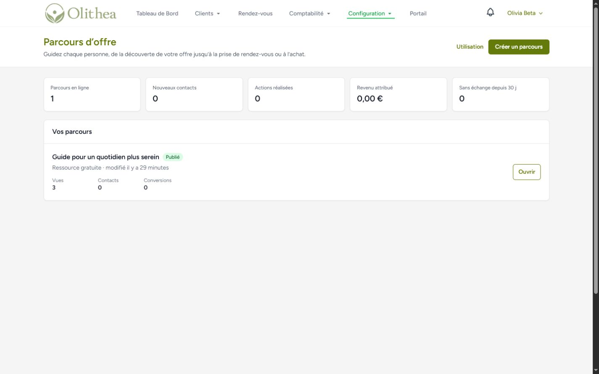

## 2. Choisir le bon objectif

L’assistant propose six objectifs. Choisissez celui qui correspond à l’action finale attendue.

| Objectif | À utiliser lorsque | Action finale |
|---|---|---|
| Obtenir des réservations | Vous présentez une séance ou une prestation | Ouvrir l’agenda Olithea |
| Remplir un atelier | Vous organisez un événement daté | Ouvrir l’inscription à l’événement |
| Offrir une ressource | Vous proposez un guide, un audio ou une vidéo | Remettre la ressource après le formulaire |
| Proposer une formation | Vous vendez ou ouvrez l’accès à une formation | Ouvrir la formation Olithea |
| Vendre un bon cadeau | Vous souhaitez promouvoir les bons cadeaux | Ouvrir la page d’achat existante |
| Recevoir une demande qualifiée | Vous devez échanger avant de proposer une solution | Recueillir une demande courte |

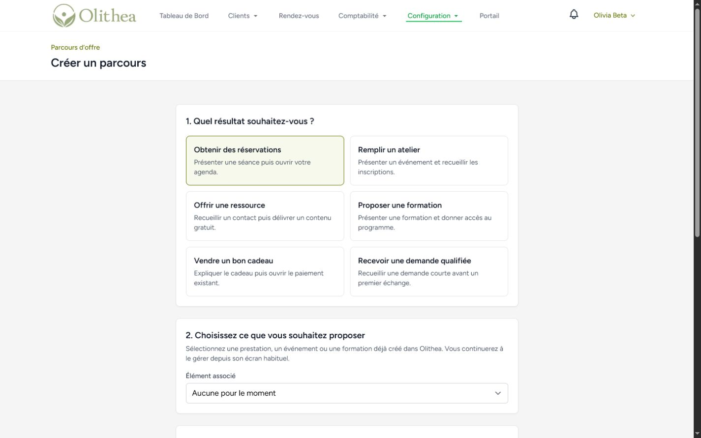

Après avoir choisi l’objectif, sélectionnez un exemple métier. Le modèle prépare un brouillon entièrement modifiable et ne publie rien automatiquement.

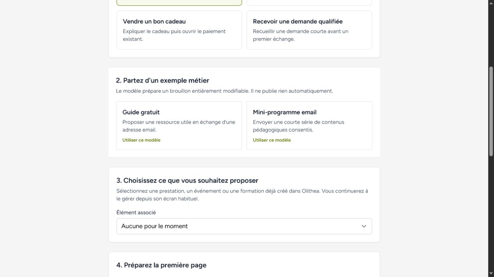

### Associer un élément Olithea

Pour une réservation, un atelier ou une formation, sélectionnez l’élément déjà créé. Le parcours dirige ensuite le visiteur vers le bon écran, sans dupliquer vos disponibilités, vos tarifs ou vos inscriptions.

Pour une ressource gratuite, vous pouvez:

- déposer un fichier privé PDF, ZIP, audio ou vidéo;
- indiquer un lien HTTPS vers une ressource déjà hébergée.

## 3. Rédiger la première page

Le nom du parcours sert à vous repérer dans Olithea. Le titre public est celui que les visiteurs verront.

Une structure efficace:

- **Titre:** le résultat ou la situation du visiteur;
- **Présentation:** deux ou trois phrases concrètes;
- **Bouton:** un verbe d’action qui annonce ce qui va se passer.

Exemple:

> **Titre:** Retrouvez des repères simples pour mieux préparer votre sommeil  
> **Présentation:** Un guide court avec cinq habitudes à tester progressivement, préparé par votre praticien.  
> **Bouton:** Recevoir le guide

Évitez les titres vagues comme « Bienvenue », « Ma méthode » ou « Changez votre vie ». Le visiteur doit comprendre l’offre en quelques secondes.

## 4. Organiser les étapes

La vue du parcours permet de modifier, ajouter et réordonner les étapes. Les modifications restent privées jusqu’à la prochaine publication.

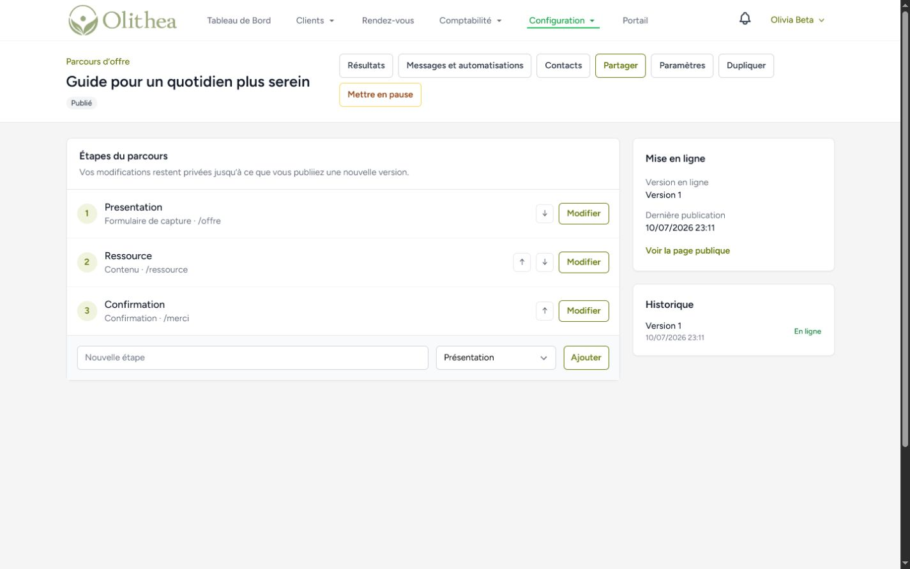

Chaque étape peut contenir:

- un titre et une présentation;
- le public concerné;
- les résultats proposés;
- le déroulement;
- les informations pratiques;
- une courte FAQ;
- un formulaire;
- l’étape suivante ou l’action Olithea associée.

### Formulaire: demander le strict nécessaire

L’adresse email est obligatoire pour répondre à la demande. N’ajoutez le téléphone, la ville ou le code postal que s’ils sont réellement utiles.

Bon réglage pour une ressource gratuite:

- prénom;
- adresse email;
- consentement aux relances séparé et facultatif.

Bon réglage pour une demande qualifiée:

- prénom;
- adresse email;
- téléphone facultatif;
- préférence de contact.

Plus le formulaire est long, plus il crée de friction. Ne demandez jamais d’informations médicales ou de notes cliniques dans ce formulaire marketing.

## 5. Prévisualiser et publier

Utilisez **Prévisualiser** avant chaque publication. L’aperçu est privé, temporaire et ne permet pas d’envoyer le formulaire.

Contrôlez:

1. le titre et le bouton sur téléphone;
2. la clarté de l’offre pour une personne qui ne vous connaît pas;
3. le nombre de champs demandés;
4. l’étape ouverte après chaque bouton;
5. la disponibilité de la prestation, de l’événement, de la formation ou du fichier;
6. les mentions de confidentialité.

Cliquez ensuite sur **Publier**. Une version indépendante est créée. Vous pouvez continuer à modifier le brouillon sans changer immédiatement la page en ligne.

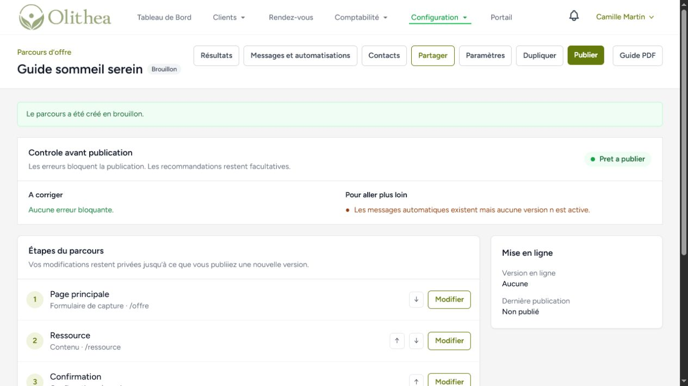

## 6. Préparer les messages et automatisations

Un parcours peut utiliser jusqu’à trois messages. Le premier répond à l’action demandée. Les relances facultatives nécessitent un consentement distinct.

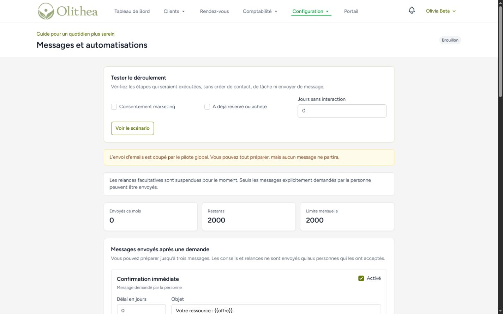

Séquence recommandée pour une ressource gratuite:

1. **Immédiatement:** remettre la ressource demandée;
2. **Deux jours plus tard:** apporter un conseil complémentaire utile;
3. **Cinq à sept jours plus tard:** proposer une prochaine étape claire, par exemple une séance découverte.

Bonnes pratiques:

- chaque message doit apporter une information utile;
- utilisez un objet précis et sobre;
- gardez un seul appel à l’action;
- ne répétez pas trois fois la même proposition;
- respectez les heures silencieuses;
- utilisez **Tester le déroulement** avant activation;
- suspendez les relances si l’offre ou la ressource n’est plus disponible.

La simulation ne crée aucun contact, aucune tâche et n’envoie aucun message.

### Prévisualiser un message avant de l’activer

L’éditeur affiche désormais une estimation des destinataires potentiellement concernés. Cette estimation retire les personnes désinscrites, les adresses supprimées et les contacts ayant reçu un message marketing trop récemment.

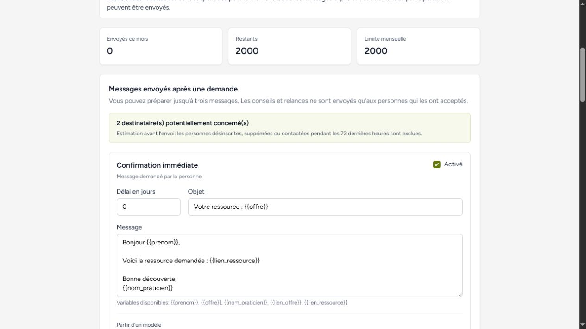

Pour chaque message:

1. choisissez éventuellement un modèle sobre;
2. adaptez l’objet et le texte à votre offre;
3. cliquez sur **Actualiser l’aperçu** pour remplacer les variables par des données d’exemple;
4. corrigez les avertissements concernant l’objet, le lien ou une variable inconnue;
5. cliquez sur **M’envoyer un test**;
6. vérifiez l’email reçu sur votre propre adresse;
7. enregistrez seulement après cette relecture.

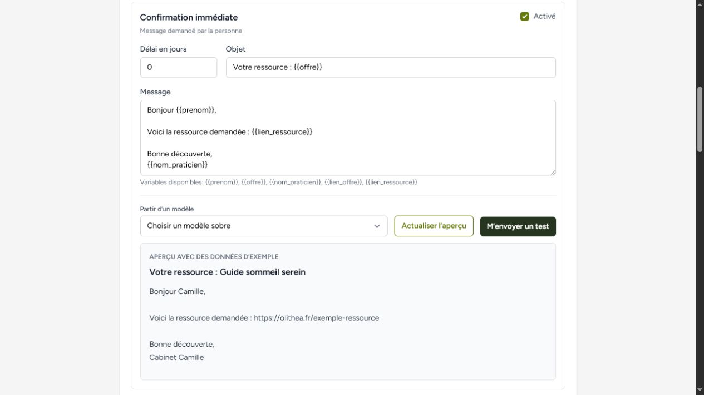

Un message test ne contacte jamais une personne de votre liste, ne consomme pas le suivi d’une campagne et ne déclenche aucune automatisation.

## 6 bis. Utiliser l’éditeur enrichi

L’éditeur conserve des choix de style volontairement limités pour garantir une page lisible sur téléphone. L’assistant de rédaction analyse uniquement le brouillon affiché et n’applique aucune modification sans votre accord.

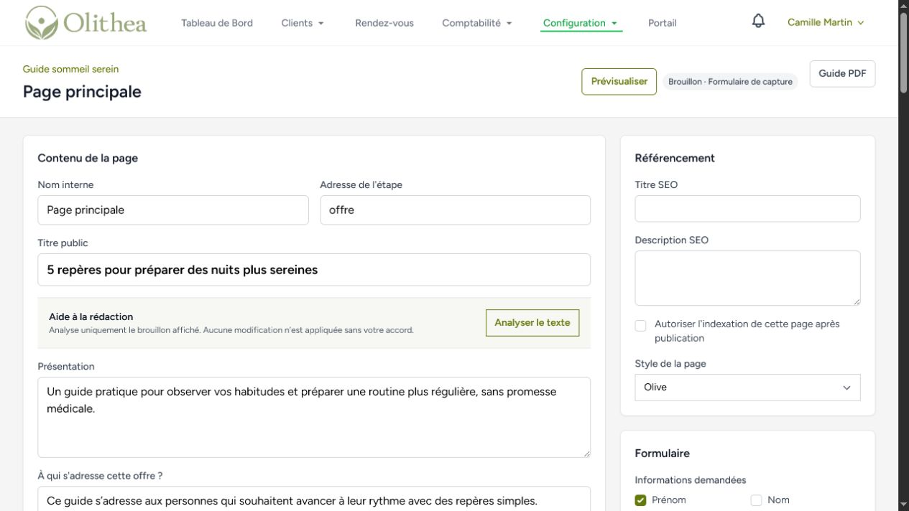

Dans **Organisation visuelle**, activez uniquement les sections utiles, puis faites-les glisser pour choisir leur ordre. Les blocs disponibles couvrent l’image principale, la galerie, la vidéo, les témoignages, l’intervenant, le tarif et les informations pratiques.

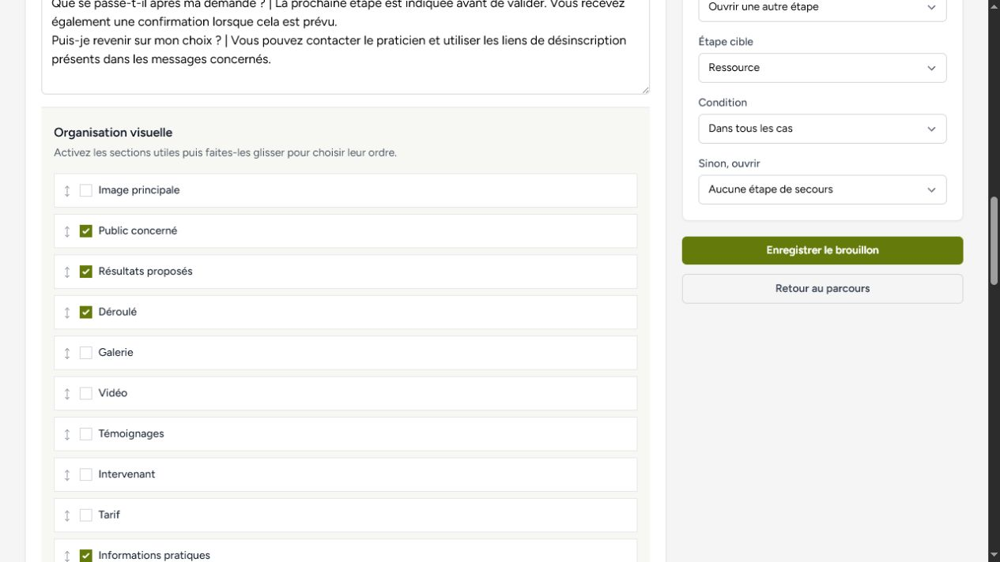

Vous pouvez ajouter jusqu’à trois questions personnalisées non médicales. Chaque question doit indiquer sa finalité. Utilisez une condition seulement lorsqu’elle simplifie réellement le formulaire.

## 7. Partager et mesurer l’origine des visites

Le lien principal convient à votre site ou à votre profil. Pour Instagram, une newsletter, Google Business ou un partenaire, créez un lien de campagne distinct.

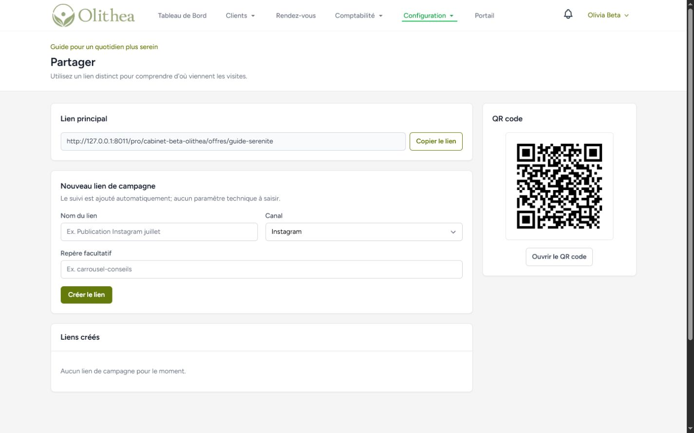

Exemples de noms utiles:

- Instagram - publication guide sommeil - juillet;
- Newsletter - atelier respiration - septembre;
- Partenaire - cabinet Dupont;
- Affiche salle d’attente - QR code.

Un nom précis permet ensuite de comparer les visites, les formulaires et les actions réalisées. Le QR code peut être utilisé sur une affiche, une carte ou un support imprimé.

## 8. Ce que voit le visiteur

La page publique est conçue pour être lisible sur téléphone. Le visiteur peut comprendre l’offre et agir sans créer de compte Olithea.

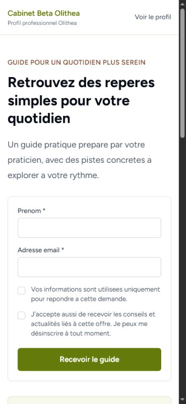

La case de consentement marketing reste séparée et non cochée. Une personne peut recevoir ce qu’elle a demandé sans accepter des relances facultatives.

## 9. Suivre les personnes intéressées

L’écran **Personnes intéressées** regroupe les demandes issues des parcours. Il ne remplace pas le dossier client ni les notes de séance.

Vous pouvez:

- rechercher une personne;
- suivre son étape dans le pipeline;
- ajouter une étiquette;
- créer une tâche de rappel;
- consulter les consentements et les messages;
- exporter la liste;
- anonymiser les données marketing sans supprimer les rendez-vous ou factures existants.

Utilisez les notes uniquement pour le suivi commercial ou organisationnel. Les informations cliniques restent dans les espaces prévus à cet effet.

### Filtres, actions groupées et prochaine action

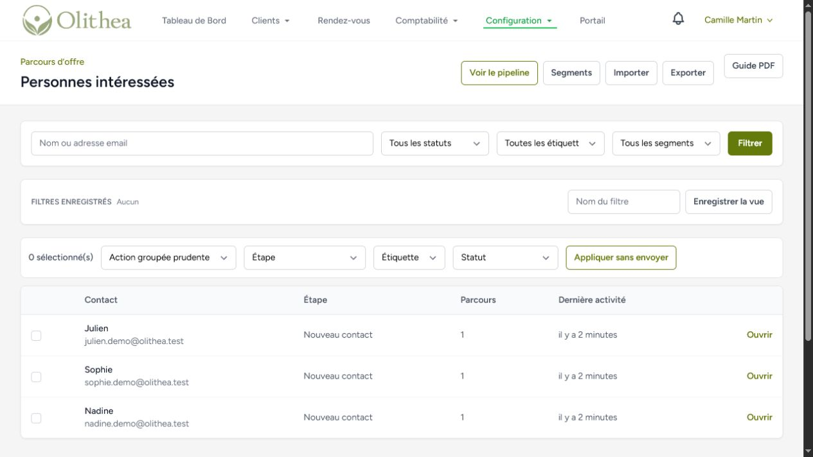

- enregistrez les filtres que vous utilisez souvent;
- sélectionnez au maximum 100 contacts pour une action groupée;
- vérifiez le nombre affiché avant de confirmer;
- les actions groupées déplacent, classent ou étiquettent, mais n’envoient aucun message;
- la fiche contact peut rapprocher les rendez-vous, inscriptions, formations et achats, sans afficher les notes cliniques;
- si Olithea propose un doublon, contrôlez l’identité avant de fusionner.

### Pipeline et objectifs

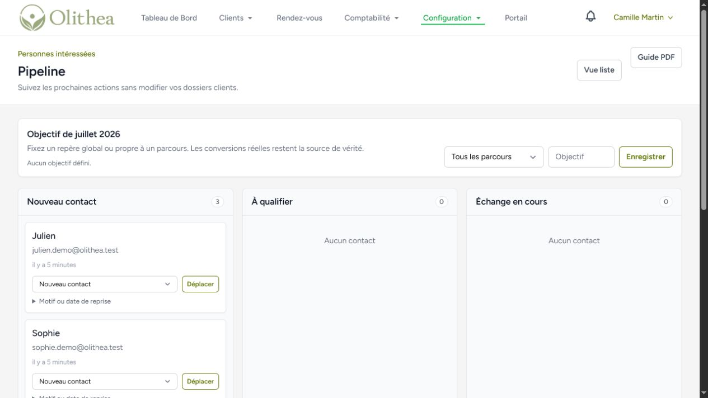

Vous pouvez déplacer une fiche par glisser-déposer. Pour **Pas maintenant**, indiquez un motif et, lorsque la personne l’a demandé, une date de reprise. Les objectifs servent de repère; les réservations et achats confirmés restent la source de vérité.

### Importer un fichier CSV

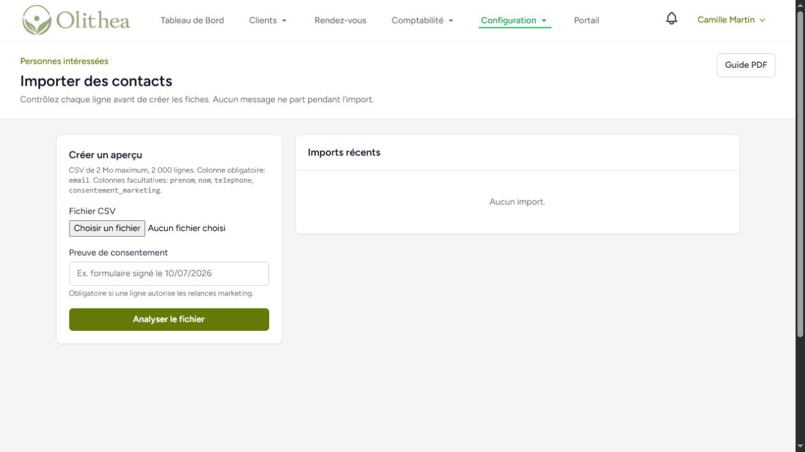

Le fichier doit contenir `email`. Il peut aussi contenir `prenom`, `nom`, `telephone` et `consentement_marketing`.

1. déposez le fichier CSV;
2. indiquez la preuve de consentement si une ligne autorise les relances;
3. consultez l’aperçu et le rapport des lignes ignorées;
4. confirmez l’import;
5. annulez-le si nécessaire avant tout envoi.

Une adresse invalide, un doublon dans le fichier ou un contact déjà présent est ignoré. Aucun message n’est envoyé pendant l’import. Une fois qu’un message a été envoyé à l’un des contacts créés, l’annulation globale de l’import est volontairement bloquée.

## 10. Programmer une campagne

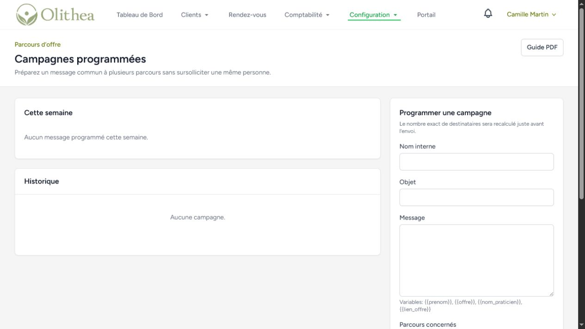

Une campagne planifiée peut concerner plusieurs parcours. Au moment exact de l’envoi, Olithea revérifie le consentement, les désinscriptions, la réputation de l’expéditeur, les limites progressives et la fréquence des messages.

1. donnez un nom interne précis;
2. rédigez un objet et un message sobres;
3. sélectionnez les parcours concernés;
4. choisissez une date future;
5. relisez la semaine affichée;
6. annulez la campagne avant son traitement si nécessaire.

Le même contact n’est compté qu’une fois, même s’il est présent dans plusieurs parcours sélectionnés.

## 11. Comprendre la relance d’abandon

Une relance d’abandon n’est créée que lorsqu’une réservation ou un paiement réel a été commencé puis laissé incomplet. Une simple visite de page ne suffit pas.

- un délai raisonnable est respecté;
- une seule relance maximum peut partir;
- le consentement marketing et les règles de délivrabilité sont revérifiés;
- la relance s’arrête après réservation, achat, annulation, remboursement ou désinscription;
- si un autre message marketing a été envoyé récemment, la relance est arrêtée.

## Cas d’usage recommandés

### Guide gratuit vers séance découverte

**But:** faire découvrir votre approche avant de proposer un rendez-vous.

- Page 1: expliquer le problème traité par le guide;
- Formulaire: prénom et email;
- Page 2: remettre le guide;
- Messages: remise, conseil complémentaire, invitation à réserver;
- Partage: site, Instagram, newsletter et partenaires.

### Atelier ponctuel

**But:** remplir un atelier sans répondre manuellement aux mêmes questions.

- Associer l’événement Olithea;
- préciser date, lieu, public et nombre de places;
- répondre aux objections dans la FAQ;
- terminer par l’inscription à l’événement;
- créer un lien par canal de communication.

### Séance découverte

**But:** aider une personne hésitante à comprendre la séance avant d’ouvrir l’agenda.

- Associer la prestation réservée en ligne;
- expliquer pour qui elle est adaptée;
- décrire le déroulement et la durée;
- éviter toute promesse médicale non démontrable;
- terminer par **Voir les disponibilités**.

### Demande qualifiée

**But:** recueillir une demande lorsque la bonne proposition dépend d’un premier échange.

- poser peu de questions;
- indiquer le délai de réponse habituel;
- créer automatiquement une tâche de rappel;
- ne pas demander de données de santé dans le formulaire.

### Formation ou bon cadeau

**But:** mieux expliquer la valeur avant d’ouvrir la page d’achat existante.

- détailler ce qui est inclus;
- indiquer les modalités pratiques;
- répondre aux questions fréquentes;
- laisser Olithea gérer l’accès ou le paiement.

## Checklist avant de partager un lien

- [ ] L’offre répond à un besoin unique et compréhensible.
- [ ] Le titre décrit un résultat ou une situation concrète.
- [ ] Le bouton annonce clairement l’action suivante.
- [ ] Les informations demandées sont strictement nécessaires.
- [ ] La case de relance marketing est facultative et non cochée.
- [ ] Chaque bouton ouvre la bonne étape.
- [ ] La destination Olithea associée est disponible.
- [ ] Le parcours a été testé sur téléphone.
- [ ] Les messages ont été relus et simulés.
- [ ] Un lien distinct existe pour chaque campagne importante.

## En cas de problème

- **Le parcours n’est pas visible:** vérifiez qu’il est publié et non en pause.
- **Le bouton ne fonctionne plus:** vérifiez que la prestation, l’événement ou la formation associée existe toujours.
- **Un fichier ne se télécharge pas:** remplacez-le dans le brouillon, puis publiez une nouvelle version.
- **Les statistiques restent à zéro:** vérifiez que la mesure est activée pour le pilote.
- **Les messages ne partent pas:** vérifiez l’activation, le consentement, les heures silencieuses et la limite mensuelle.
- **Une modification n’apparaît pas:** publiez le brouillon pour créer une nouvelle version en ligne.
